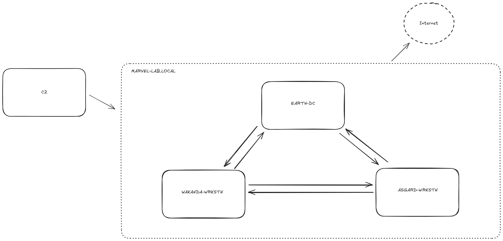

# SOC Alerts Analysis Project
This repository contains my analysis of multiple alerts in Microsoft Sentinel. The project demonstrates detection, investigation, and recommended mitigation/remediation steps.

## Scenario
As a SOC Analyst, I have been given alerts regarding various activities across multiple hosts. Some of them are connected and some of them are not. I need to:

## Objective
 
- Find other malicious activity that did not fire alerts
- Write-up an Incident report including:
    - Maliciously Classified Alerts
    - Other activity identified
    - Detection Login Feedback (new and existing)
    - Playbook Generation Ideas
    - Containment Strategy
    - Detection Logic Feedback (new and existing)
    - Playbook Generation Ideas
    - Containment Strategy

## Network Topology Diagram

## Workflow
1. Collected alert logs from Microsoft Sentinel
2. Investigated each alert to identify tactics, techniques, and procedures (TTPs)
3. Compared findings to MITRE ATT&CK framework
4. Developed remediation strategies

